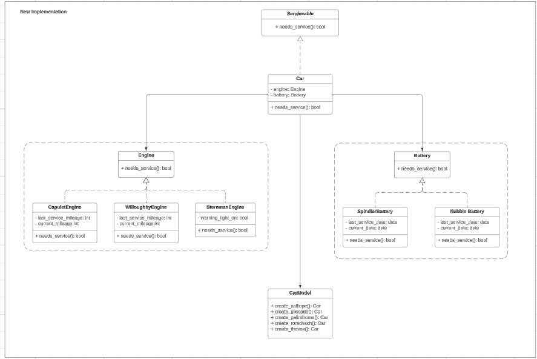

# Rental Fleet Management System

## Overview

This project implements a service management system for a car rental fleet. It determines whether cars in the fleet need servicing based on their engine and battery types. The system is designed to be extensible, allowing for easy addition of new car models and service criteria.

## Features

- Support for multiple car models with different engine and battery combinations
- Extensible design for easy addition of new car models and service criteria
- Utilizes Factory and Strategy patterns for flexible object creation and behavior
- Implemented in TypeScript for strong typing and better developer experience

## UML Diagram



## Project Structure

```
rental_fleet/
├── src/
│   ├── models/
│   │   ├── Car.ts
│   │   ├── engine/
│   │   │   ├── Engine.ts
│   │   │   ├── CapuletEngine.ts
│   │   │   ├── WilloughbyEngine.ts
│   │   │   └── SternmanEngine.ts
│   │   └── battery/
│   │       ├── Battery.ts
│   │       ├── SpindlerBattery.ts
│   │       └── NubbinBattery.ts
│   ├── services/
│   │   └── CarService.ts
│   ├── factories/
│   │   └── CarFactory.ts
│   └── main.ts
├── package.json
└── tsconfig.json
```

## Prerequisites

- Deno [installation guide](https://docs.deno.com/runtime/manual/)

## Installation and Usage

1. Clone the repository:
   ```bash
   git clone
   cd ts-rental-fleet-management
   ```

2. Run the example:
   ```
   deno run --allow-read src/main.ts
   ```

This will run the example in `main.ts`, which demonstrates the creation and service checking of different car models.

## Adding New Car Models

1. If needed, create new engine or battery classes in the respective folders.
2. Add a new method to `CarFactory` in `src/factories/CarFactory.ts` for the new car model.
3. Update `src/main.ts` to demonstrate the new car model.

## Running Tests

(Add information about running tests when they are implemented)
